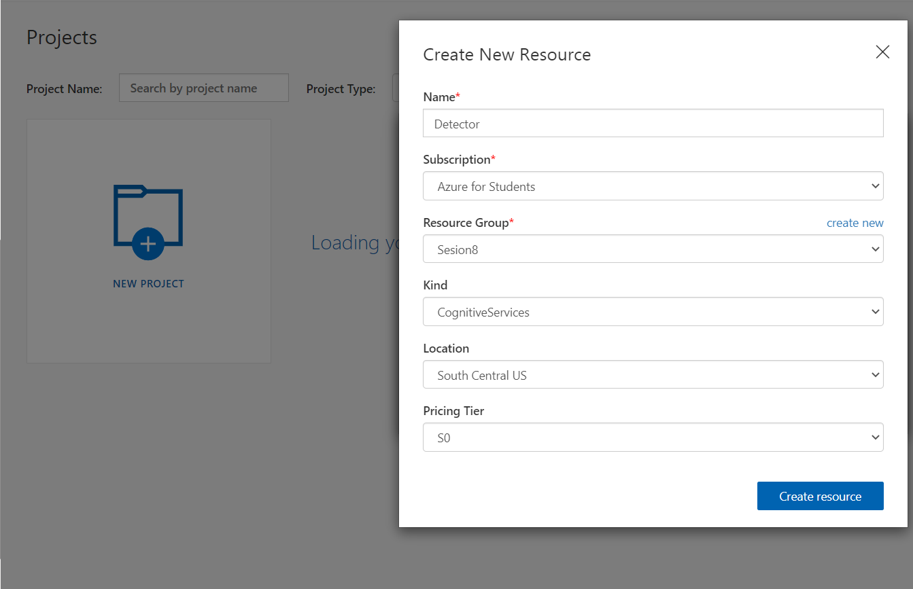
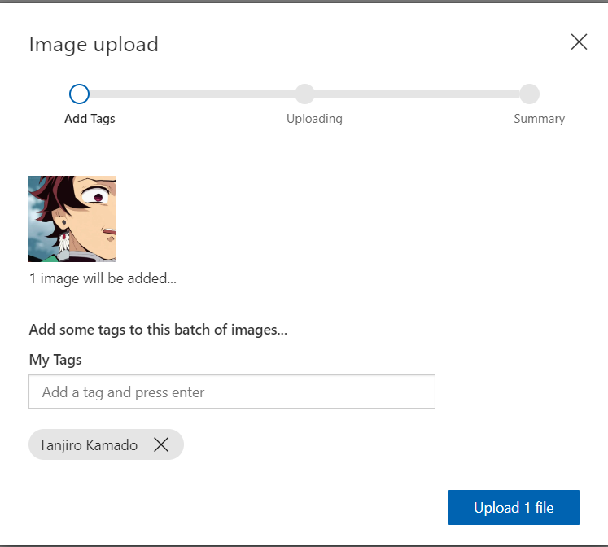
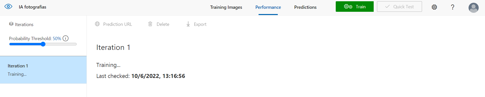
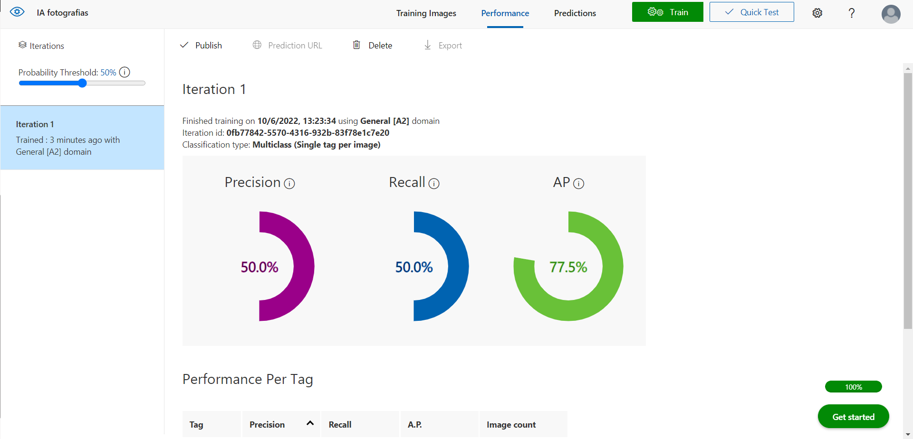
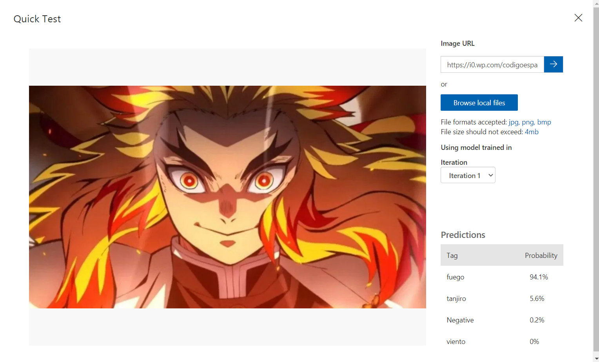

# En este apartado veremos como entrenar una IA para detectar ciertos objetos en fotografias

- Primero debemos iniciar secion en [customvision](https://www.customvision.ai/) una ves iniciada sesion crearemos un nuevo projecto y dentro de este crearemos un nuevo recurso 

Al crear el recurso nos pedira que agregemos las fotografias que deseamos que la IA analize y busque patrones de otras fotografias

En el apartado de Tags debemos escribir que es lo que es o como queremos que lo relacione y le damos en "upload"

Una ves hallamos subido todas las fotografias daremos click en "Train" y esperaremos 

Una ves cargado la pagina clickearemos quick Test

Para testear deberemos escojer otra fotografia y pegar la direccion URL y pegarla en quick test para que la IA intente detectar que es lo que contiene la imagen

